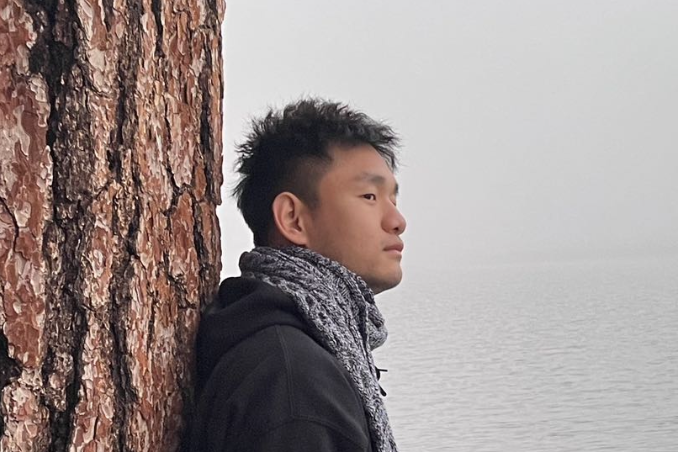

I am a first-year Ph.D. Computer Science student at [ExpoLab](https://expolab.org), UC Davis. My Principal Investigator is [Prof.Sadoghi](https://expolab.org). My main research interest is BFT consensus protocols, especially HotStuff variants and concurrent consensus protocols. My latest research outcome is a high-throughput Practical View-Change-Less Protocol (PVP) that enables primary rotation, fast view synchronization, and concurrent consensus.

## Research

I conduct my research on our resilient data platform **[ResilientDB](https://resilientdb.com)** [[blog](https://blog.resilientdb.com), [codebase](https://github.com/resilientdb/resilientdb)], a distributed ledger centered around a democratic and decentralized computational model that further aims to unify secure transactional and real-time analytical processing. PVP was implemented in the history version of ResilientDB and I finished all experiments there. Now we gradually switch to working on a brand new version called '**[NexRes](https://resilientdb.com)**'. Led by my outstanding co-work Junchao, in NexRes, we have re-architected and re-imagined modular system design from scratch that embeds parallelism and deep pipelining at every layer to fully exploit modern hardware and cloud infrastructure globally. We have a strong NexRes team and I am responsible for concurrent consensus protocols and recovery in NexRes.

## Publications

[Details](publications)

[1] Kang, D., Rahnama, S., Hellings, J., & Sadoghi, M. (2023). Practical View-Change-Less Protocol through Rapid View Synchronization. [*arXiv preprint arXiv:2302.02118*.](https://arxiv.org/abs/2302.02118)

## Awards

- ##### GGCS 2023 Spring Quarter Fellowship Award, UC Davis

## Teaching

- ECS165A, Databases, UC Davis, [23Winter](https://expolab.org/ecs165a-winter2023.html), Teaching Assistant

#### Science is for Human Development
*The purpose of scientific research is to bring a better life to the human beings. I fully support any action that is conducive to the spread of universal values and the development of human civilization, and firmly stand with the oppressed weak around the world.*